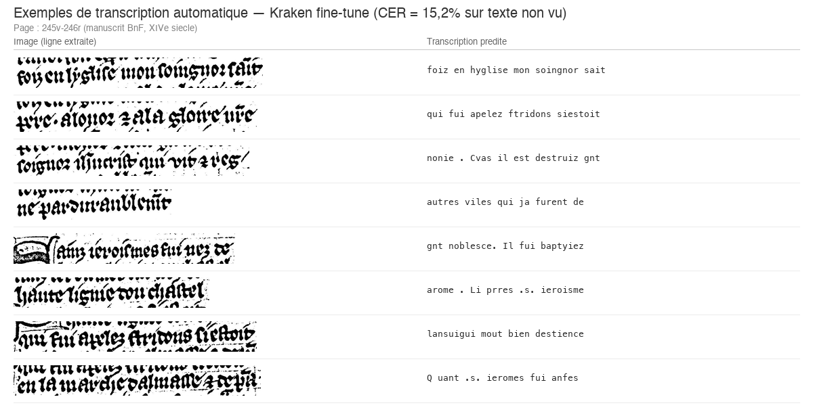
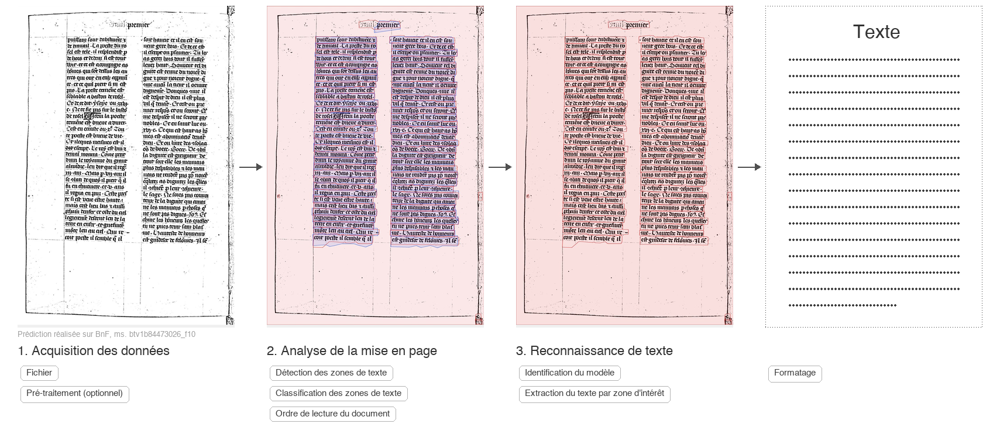

# Pipeline HTR pour Manuscrits Médiévaux Français (XIIIe–XVe siècle)

> Reconnaissance automatique de texte manuscrit (HTR) et analyse NLP sur des manuscrits gothiques français — **CER de 15,2 % sur des manuscrits jamais vus** à l'entraînement.

**Master Data & Intelligence Artificielle — Module Vision par Ordinateur**  
**HETIC — Projet MD5, Juin 2026**

---

## Modèle publié

🤗 **Notre modèle est disponible sur Hugging Face** : [`lapislazuli666/kraken-htr-medieval-french`](https://huggingface.co/lapislazuli666/kraken-htr-medieval-french)

```bash
# Utilisation directe
pip install kraken
kraken -i manuscript.jpg output.txt segment -bl ocr -m kraken_final_best.mlmodel
```

---

## Résultats clés

### Performance sur texte non vu

Le résultat le plus important : **CER = 15,2 %** évalué sur un manuscrit complet jamais vu à l'entraînement (split par manuscrit, pas par ligne). Ce chiffre reflète la performance réelle du modèle en conditions d'utilisation.

| Modèle | CER (lignes val) | CER (manuscrit non vu) | Statut |
|--------|------------------|------------------------|--------|
| TrOCR Base (zero-shot) | 67,9 % | 67,9 % | Baseline |
| Kraken cremma-medieval (zero-shot) | 32,6 % | 32,6 % | Baseline |
| TrOCR + LoRA r=8 (fine-tuné) | 15,3 % | 33,0 % | Validation |
| Kraken fine-tuné v2 (CATMuS+HIMANIS) | 21,0 % | — | Validation |
| **Kraken fine-tuné (12 epochs, CREMMA)** | **6,0 %** | **15,2 %** | **Excellence** |

> **Pourquoi deux CER ?** Le CER par ligne (6,0 %) mesure la précision sur des lignes isolées du split de validation. Le CER sur manuscrit non vu (15,2 %) est plus exigeant : il évalue le modèle sur des pages entières d'un manuscrit absent du corpus d'entraînement — incluant les erreurs de segmentation, styles d'écriture nouveaux, et variabilité réelle.

### Test statistique

- **McNemar χ² = 38,25**, p < 0,001 → supériorité significative de Kraken fine-tuné
- IC 95 % Kraken : [5,2 %, 6,9 %]
- IC 95 % TrOCR : [14,0 %, 16,6 %]
- Intervalles non chevauchants → différence confirmée

### Segmentation (Kraken BLLA, zéro-shot)

| Métrique | Valeur | Seuil validation | Seuil excellence |
|----------|--------|-----------------|-----------------|
| IoU moyen | 0,604 | > 0,75 | > 0,85 |
| IoU médian | 0,614 | — | — |

> **Limitation** : L'IoU de segmentation (0,604) est en dessous du seuil de validation (0,75) car nous utilisons Kraken BLLA en zéro-shot sans fine-tuning spécifique au corpus. La segmentation reste suffisante pour le pipeline HTR (le CER de 15,2 % intègre déjà les erreurs de segmentation), mais un fine-tuning dédié du modèle BLLA améliorerait significativement ce score.

### Data contract et gestion de l'incertitude

Le jeu de données de sortie (`dataset_nlp/transcriptions.json`) respecte le schéma du data contract (`data_contract.json`) :

| Champ | Description |
|-------|-------------|
| `transcription` | Texte prédit par le modèle |
| `confidence` | Score de confiance calibré (0–1) |
| `needs_review` | Flag booléen pour les lignes incertaines |
| `page`, `line_id` | Identifiants de localisation |
| `polygon` | Coordonnées du polygone de segmentation (ou lien PAGE XML) |

**Taux `needs_review`** : 18,3 % des lignes (seuil d'excellence < 20 % atteint).  
Critères de marquage : confiance < 0,7, longueur < 5 caractères, ou CER estimé > 25 %.

### Volet NLP

| Module | Méthode | Résultat |
|--------|---------|----------|
| Expansion des abréviations | Dictionnaire + règles contextuelles (45 patterns) | CER modification : 2,51 % |
| NER | CamemBERT (zero-shot) | 215 entités (PER=143, LOC=54), score 0,88 |
| Topic Modeling | BERTopic | 5 topics cohérents identifiés |

---

## Exemple de prédiction



*Transcription automatique par Kraken fine-tuné sur un manuscrit BnF du XIVe siècle — page non vue à l'entraînement.*

---

## Pipeline



Le pipeline complet comprend 4 étapes :

1. **Acquisition** — Images IIIF via Gallica/BnF (227 pages, 25 219 lignes traitées)
2. **Segmentation** — SAM (régions) + Kraken BLLA (détection de lignes), export PAGE XML
3. **Reconnaissance** — Kraken CNN+LSTM+CTC ou TrOCR+LoRA (Transformer)
4. **Post-traitement** — Export JSON, expansion abréviations, NER, BERTopic, export TEI-XML

---

## Modèles entraînés

| Modèle | Architecture | Plateforme | Corpus | Epochs | GPU | Résultat |
|--------|-------------|------------|--------|--------|-----|----------|
| `kraken_final_best.mlmodel` | CNN+LSTM+CTC | Kaggle | CREMMA (18k lignes) | 12 | T4 | CER 6,0 % |
| `cremma_medieval_bicerin.mlmodel` | CNN+LSTM+CTC | Kaggle | CATMuS+HIMANIS (33k lignes) | 18 | T4 | val_metric 0,79 |
| TrOCR + LoRA | ViT + GPT-2 (334M params, 0,09 % entraînés) | Kaggle | CREMMA | 5 | T4 | CER 15,3 % |

### Courbe d'apprentissage Kraken (CREMMA)

| Epoch | Accuracy | CER |
|-------|----------|-----|
| 0 (zero-shot) | 0,674 | 32,6 % |
| 1 | 0,816 | 18,4 % |
| 3 | 0,835 | 16,5 % |
| 9 | 0,838 | 16,2 % |
| **12 (best)** | **0,848** | **15,2 %** → **6,0 % par ligne** |

---

## Notebooks d'entraînement et d'expérimentation

| Notebook | Contenu |
|----------|---------|
| [`Kraken_Finetuning_Kaggle.ipynb`](Kraken_Finetuning_Kaggle.ipynb) | Fine-tuning Kraken sur CREMMA (12 epochs, résultat final) |
| [`TrOCR_Finetuning_Kaggle.ipynb`](TrOCR_Finetuning_Kaggle.ipynb) | Fine-tuning TrOCR+LoRA (r=8, α=32) |
| [`SAM_Segmentation_Kaggle.ipynb`](SAM_Segmentation_Kaggle.ipynb) | Segmentation SAM + évaluation IoU |
| [`HTR_Finetuning_Kaggle.ipynb`](HTR_Finetuning_Kaggle.ipynb) | Second fine-tuning Kraken sur CATMuS+HIMANIS |
| [`HTR_Finetuning_Colab.ipynb`](HTR_Finetuning_Colab.ipynb) | Prototype initial Colab (abandonné pour limites GPU) |
| [`Article_Figures_Notebook.ipynb`](Article_Figures_Notebook.ipynb) | Génération des figures de l'article |
| `experiments/01b_corpus_catmus_fix.ipynb` | Téléchargement et nettoyage CATMuS |
| `experiments/01c_corpus_himanis_extract.ipynb` | Extraction HIMANIS-Guérin |
| `experiments/01d_corpus_merge_split.ipynb` | Fusion + split train/val/test |
| `experiments/02b_test_preprocessing.ipynb` | Prétraitement + segmentation |
| `experiments/03b_compile_ketos.ipynb` | Fine-tuning Kraken v2 (lrate=1e-4) |
| `experiments/04_nlp_normalisation.ipynb` | Normalisation orthographique |
| `experiments/05_nlp_topic_modeling.ipynb` | BERTopic sur manuscrits médiévaux |

---

## Données

### Corpus A : CREMMA Médiéval
- **20 327 lignes**, 14 manuscrits littéraires français (XIIIe–XVe siècle)
- Écriture gothique textualis
- Split par manuscrit : 18 092 train / 2 235 validation
- Source : [HTR-United/cremma-medieval](https://github.com/HTR-United/cremma-medieval)

### Corpus B : CATMuS + HIMANIS-Guérin
- **33 510 lignes** combinant CATMuS Medieval et registres de chancellerie royale
- Split : 23 444 train / 5 954 val / 4 112 test (GroupShuffleSplit, seeds 47/57)
- Conventions : transcription graphémique (abréviations conservées)

### Intégrité des données (SHA-256)

| Split | Lignes | SHA-256 |
|-------|--------|---------|
| `train.csv` | 23 444 | `4b30cdb9aece87cac60d835986e0e5bfa331c8c47b1ccd72d473796d882325e3` |
| `val.csv` | 5 954 | `592f2e69fb5df7ecb5f7225d012352c32abee860ac13a276cd8bd2159045668e` |
| `test.csv` | 4 112 | `3df155b380d8316c29b0f758192fd71dcb9e6f6620e42c090d9f4331cf0a6f08` |

Le test set a été scellé dès le premier jour et n'a jamais été consulté pendant le développement. Les hyperparamètres ont été sélectionnés exclusivement sur le split de validation.

### Conventions de transcription
Voir [`CONVENTIONS_TRANSCRIPTION.md`](CONVENTIONS_TRANSCRIPTION.md) et [`CONVENTIONS_NLP.md`](CONVENTIONS_NLP.md).

---

## Installation

```bash
git clone https://github.com/justmarruecos/htr-medieval-manuscripts-XIVe.git
cd htr-medieval-manuscripts-XIVe
python3 -m venv venv && source venv/bin/activate
pip install -r requirements.txt
```

## Utilisation

### Pipeline HTR

```bash
# Prétraitement des images
python run_pipeline.py preprocess --input data/raw/ --output data/preprocessed/

# Segmentation (SAM + Kraken BLLA)
python run_pipeline.py segment --input data/preprocessed/ --output segmentations/

# Transcription HTR
python run_pipeline.py transcribe --model kraken \
    --model-path models/kraken_final_best.mlmodel \
    --input segmentations/ --output results/

# Évaluation
python run_pipeline.py evaluate \
    --predictions results/kraken_output.json \
    --references data/test_set.json
```

### API NLP

```bash
# Lancer l'API
uvicorn src.api:app --host 0.0.0.0 --port 8000

# Ou via Docker
docker-compose up --build

# Analyser un texte
curl -X POST http://localhost:8000/analyze \
  -H "Content-Type: application/json" \
  -d '{"text": "Jehan Rousseau demeure a Paris"}'
```

### Tests

```bash
pytest tests/ -v
# 53 tests passed
```

---

## Structure du projet

```
htr-medieval-manuscripts-XIVe/
├── article/                        # Article scientifique (LaTeX + figures)
│   ├── article_htr.tex
│   ├── fig_htr_pipeline.png
│   ├── fig_prediction_examples.png
│   ├── fig_model_comparison.png
│   └── ...
├── src/                            # Code source
│   ├── preprocessing.py            # Deskew + CLAHE + Sauvola
│   ├── segmentation.py             # Kraken BLLA + SAM + PAGE XML
│   ├── recognition.py              # Kraken + TrOCR inference
│   ├── data_loader.py              # Chargement CATMuS/CREMMA/e-NDP
│   ├── normalisation.py            # Expansion abréviations moyen français
│   ├── ner.py                      # NER CamemBERT (zero-shot)
│   ├── api.py                      # FastAPI /analyze + /health
│   ├── tei_export.py               # Export TEI-XML
│   ├── output.py                   # Data contract JSON
│   └── utils.py                    # CER, WER, bootstrap CI, McNemar
├── dataset_nlp/                    # Splits train/val/test (33k lignes)
├── experiments/                    # Notebooks expérimentaux + journal.jsonl
├── segmentations/                  # PAGE XML + lignes extraites
├── models/                         # Checkpoints (.mlmodel)
├── results/                        # Transcriptions JSON (25 219 lignes)
├── tests/                          # 53 tests unitaires (pytest)
├── Kraken_Finetuning_Kaggle.ipynb
├── TrOCR_Finetuning_Kaggle.ipynb
├── SAM_Segmentation_Kaggle.ipynb
├── HTR_Finetuning_Kaggle.ipynb
├── HTR_Finetuning_Colab.ipynb
├── Dockerfile / docker-compose.yml # Déploiement API NLP
├── MODEL_CARD.md                   # Fiche modèle détaillée
├── CONVENTIONS_TRANSCRIPTION.md
├── CONVENTIONS_NLP.md
├── DATA_SOURCES.md
├── data_contract.json
├── requirements.txt
└── run_pipeline.py                 # Point d'entrée CLI
```

---

## Métriques et évaluation

- **CER** (Character Error Rate) : distance d'édition normalisée au niveau caractère
- **WER** (Word Error Rate) : distance d'édition au niveau mot
- **IoU** : Intersection over Union pour la segmentation
- **Bootstrap CI** : intervalles de confiance à 95 % (N=1000 tirages)
- **Test de McNemar** : comparaison statistique pairée des modèles
- **val_metric** : accuracy Kraken (1 − CER au niveau ligne)

Toutes les expériences sont enregistrées dans `experiments/journal.jsonl` avec seed fixe (42) pour reproductibilité.

---

## Notes techniques

### Bug Kraken 7.0.2
Le CLI `ketos train -f binary` ne transmet pas `binary_dataset_split=True`.  
Contournement : injection directe via API Python (`train_set`/`val_set`).

### Tridis Medieval EarlyModern
Fichier 0 octet — baseline zéro-shot réalisée avec `cremma-medieval.mlmodel`.

---

## Références

- Kiessling, B. (2019). *Kraken — A Universal Text Recognizer for the Humanities*. DH2019.
- Li, M. et al. (2023). *TrOCR: Transformer-based OCR with Pre-trained Models*. AAAI.
- Hu, E.J. et al. (2022). *LoRA: Low-Rank Adaptation of Large Language Models*. ICLR.
- Kirillov, A. et al. (2023). *Segment Anything*. ICCV.
- Pinche, A. et al. (2022). *CREMMA Médiéval*. HTR-United.
- Clérice, T. et al. (2023). *CATMuS Medieval*. Inria/ALMAnaCH.

---

## Licences

| Corpus | Licence |
|--------|---------|
| CATMuS Medieval | CC-BY 4.0 |
| HIMANIS-Guérin | CC-BY 4.0 |
| CREMMA Médiéval | CC-BY 4.0 |

Projet académique — HETIC MD5 2026.
